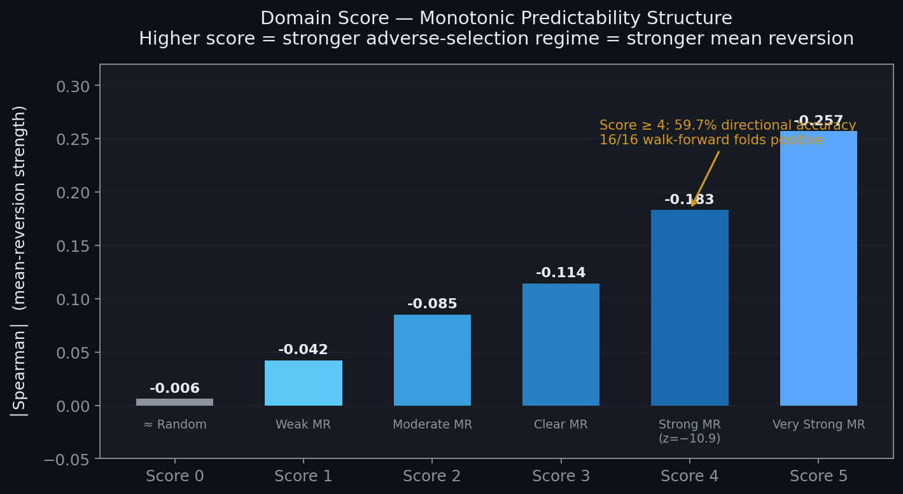
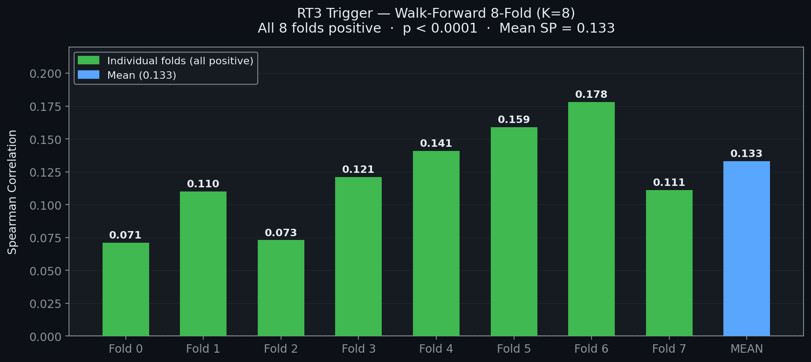
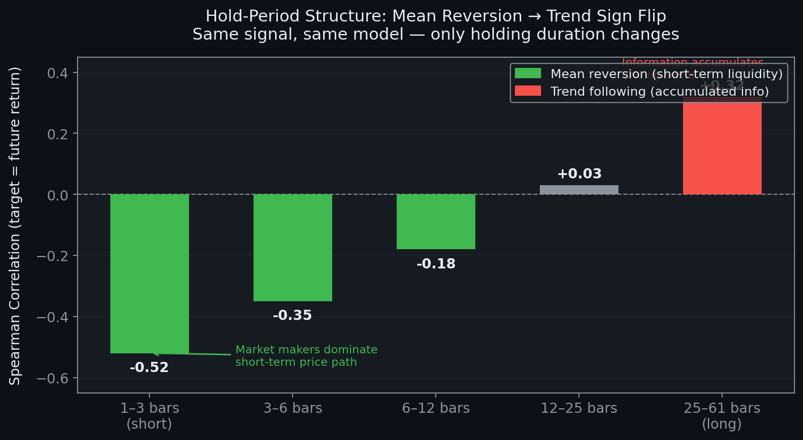

# BTC Perpetual Futures Microstructure Research

**Selective Sampling Framework for Short-Horizon Directional Prediction in BTC-USDT Perpetual Futures**

> Baseline SP ≈ −0.002 on all bars. Same data, same model — filter *when* to predict by microstructure regime → SP = 0.130, directional accuracy 59.7%, 16/16 walk-forward folds positive.

---

## TL;DR

- BTC perp returns are near-random (AC1 ≈ 0.003). Predicting *direction* universally is futile.
- Adverse-selection theory (Glosten-Milgrom 1985) predicts *when* information is actively being priced — those moments are predictable.
- I built two selective-entry detectors (RT3 Trigger, Domain Score) grounded in order-book microstructure.
- Walk-forward validation across 540M ticks of Binance + Bybit data: RT3 (8/8 folds positive), Domain Score (16/16 folds positive).
- Rolling Spearman post-filter lifts SP from 0.130 → 0.212 while trading 61% of events.

---

## Problem & Motivation

Most crypto strategies try to predict where price goes next — essentially asking the market to reveal information it hasn't priced yet. On short horizons in BTC perp, that's a near-martingale: serial autocorrelation AC1 ≈ 0.003, confirming that the prior bar's direction is almost uninformative about the next.

But "random on average" does not mean "random at every moment." Microstructure theory offers a different question: **when does the market expose exploitable structure?** According to the Glosten-Milgrom adverse-selection model, when informed traders are active, market makers widen spreads to recover adverse-selection costs. This creates an observable causal chain:

> Spread widening (adverse selection active) → sustained directional order flow (informed execution) → price move (information incorporated) → spread normalization (asymmetry resolved)

If the *completion* of this chain is detectable, the residual price move should mean-revert. That is the alpha source this research exploits.

---

## Methodology

### Data Pipeline — Volume Bars & Feature Engineering

Time-based bars are noisy in crypto: activity density varies 10× between sessions. **Volume bars** (a new bar per fixed cumulative volume) normalize information density per bar.

From aggTrades (540M ticks, Binance + Bybit BTCUSDT perp, full-year 2025) I extract **22 base features** across 5 categories (price path, volatility, order flow, microstructure, activity), then apply 5-step lags to 13 time-varying features for **87 total features**. All features are normalized via rolling percentile rank (window = 2000) for regime robustness.

→ [`vortexbar_lab.py:1017`](vortexbar_lab.py#L1017) `build_volume_bars` · [`vortexbar_lab.py:1635`](vortexbar_lab.py#L1635) `_make_feature_df`

---

### Approach 1 — RT3 Trigger: Detecting Adverse-Selection Completion

The RT3 trigger fires when two conditions hold simultaneously:

| Condition | Threshold | Rationale |
|---|---|---|
| `spread_pct` | ≥ 80th percentile (rolling) | Elevated spread = adverse selection active |
| `imb_consistency` | ≥ 0.75 over K=8 bars | Sustained directional order flow = informed execution |

**Key discovery:** The initial hypothesis was momentum ("catch the informed trader"). The actual dominant signal is **mean reversion** — both conditions being simultaneously satisfied implies the information event is nearly *complete*, leaving only the overshoot to revert.

**K=4 → K=8 transition:** At K=4, `imb_consistency` ≥ 0.75 only passes two values (0.75 and 1.0), giving coarse resolution. At K=8, three granularity levels pass, capturing flow *intensity* more precisely.

| | K=4 | K=8 |
|---|---|---|
| Spearman | 0.103 | **0.133** |
| Positive folds | 8/8 | 8/8 |
| Significance | p = 0.0002 | **p < 0.0001** |
| Dual-filter PnL | 3.00 | **7.315 (+143%)** |

→ [`vortexbar_lab.py:1321`](vortexbar_lab.py#L1321) `compute_rt3_trigger` · [`vortexbar_lab.py:2759`](vortexbar_lab.py#L2759) `_build_wf_folds_bars`

---

### Approach 2 — Domain Score: Continuous Market-State Assessment

RT3 is binary (on/off). The natural extension: "at the same trigger, does market state quality predict signal strength?" I searched 10 microstructure domains systematically and selected 6 that individually show weak predictive power but together form a clean monotonic structure:

| Element | Measures | Rationale |
|---|---|---|
| Spread expansion | Relative bid-ask spread size | Adverse-selection cost rising |
| Fast trading | Bar formation speed | High activity = information flow intensity |
| Order flow persistence | Consecutive same-direction fills | Directional pressure sustained |
| Flow shock | Sudden VPIN spike | Abrupt information asymmetry |
| Book-trade divergence | OB direction vs. trade direction mismatch | Passive vs. aggressive order conflict |
| Low volatility | Current volatility level | Quiet market amplifies mean reversion |

Each element is scored 0–1 via rolling percentile (window = 2000). The sum (0–5 scale) produces a strikingly clean monotonic relationship with predictive strength:

| Domain Score | Spearman | Regime |
|---|---|---|
| 0 | −0.006 | ≈ Random |
| 1 | −0.042 | Weak mean reversion |
| 2 | −0.085 | Moderate mean reversion |
| 3 | −0.114 | Clear mean reversion |
| 4 | −0.183 | **Strong MR** (z = −10.9, p = 6.5×10⁻²⁸) |
| 5 | −0.257 | **Very strong MR** |

**16-fold walk-forward results:**

| Metric | Result |
|---|---|
| Spearman | 0.130 |
| Positive folds | **16 / 16** |
| Directional accuracy | **59.7%** |
| Mean reversion entry return | +1.00 bp / event (gross, no ML) |
| LOFO gate Spearman | 0.308 |

→ [`ob_poc_v4.py:2152`](ob_poc_v4.py#L2152) `compute_domain_score` · [`ob_poc_v4.py:1979`](ob_poc_v4.py#L1979) `compute_composite_event_scores` · [`ob_poc_v4.py:2054`](ob_poc_v4.py#L2054) `run_walkforward_composite`

---

### Approach 3 — Rolling Spearman Post-Filter

42-fold granular analysis identified two "bad fold" patterns: (1) `kyle_lambda` spikes → trend regime where MR signal reverses; (2) `hold_bars` increase → low-volatility regime where events are frequent but moves too small to clear fees. In both cases Domain Score reads high but actual profitability is low — static percentile normalization cannot assess *whether the current regime is suitable for prediction*, only relative position within it.

The fix: compute trailing 200-event Spearman in real time and gate trades on signal quality:

| Rolling SP Threshold | Post-Filter SP | Coverage |
|---|---|---|
| ≥ 0.10 | **0.212** | 61% |
| ≥ 0.15 | **0.268** | 47% |

→ [`ob_poc_v4.py:2238`](ob_poc_v4.py#L2238) `run_walkforward_v4`

---

### Hold-Period Structure: The Sign Flip

The same signal, same model, same events — varying only holding duration reveals a structural insight about BTC perp market dynamics:

| Hold Duration | Spearman | Regime |
|---|---|---|
| 1–3 bars | **−0.52** | Strong mean reversion |
| 3–6 bars | −0.35 | Moderate mean reversion |
| 6–12 bars | −0.18 | Weak mean reversion |
| 12–25 bars | +0.03 | No signal |
| 25–61 bars | **+0.32** | Trend following (sign flip) |

Short-term: market-maker liquidity dominates, reverting overshoots. Long-term: accumulated information drives trend. The crossing point around 12–25 bars is the transition between these two market forces.

---

## Key Results

The core contribution is separating *what to predict* from *when to predict*. Applying the same LightGBM DART model to all bars yields SP ≈ −0.002. Filtering entry timing by observable microstructure conditions:

| Configuration | Spearman (WF) | Dir. Accuracy | Folds Positive |
|---|---|---|---|
| Baseline (all bars) | −0.002 | ~50% | — |
| RT3 K=8 (8-fold WF) | 0.133 | 54.2% | **8 / 8** |
| Domain Score (16-fold WF) | 0.130 | **59.7%** | **16 / 16** |
| + Rolling SP ≥ 0.10 filter | **0.212** | — | — (61% coverage) |

All results on Binance + Bybit BTCUSDT perp, full-year 2025 data, expanding-window walk-forward. Gross positive throughout; net of taker fees (7.5–11 bp round-trip) not yet achieved — considered an execution optimization problem, not a signal design problem.

---

## Research Evolution

| Stage | Approach | Outcome |
|---|---|---|
| 1 | 30+ direction-prediction experiments on time bars | AC1 ≈ 0.003 confirmed; all models near-random |
| 2 | Volume bars + 87 microstructure features + LightGBM | Feature framework established; no edge on full sample |
| 3 | RT3 Trigger (K=4→K=8), 8-fold WF | First statistically significant signal; SP 0.103→0.133 |
| 4 | Domain Score, 10-domain search → 6 elements, 16-fold WF | Monotonic structure confirmed; 16/16 positive |
| 5 | 42-fold analysis + Rolling SP filter | Regime failure modes diagnosed; SP 0.130→0.212 |

---

## About

**Woonggyu (Jake) Lee** — 17-year-old independent quantitative researcher based in South Korea. Six months into a self-directed research program on crypto market microstructure (Oct 2025 – Apr 2026).

Currently building a **Macro AI Trading Pipeline** that extends this microstructure framework with regime-adaptive filters and cross-asset signals.

Open to discussions on quantitative research, market microstructure, and ML for trading.

- Email: [leewoonggyu@outlook.kr](mailto:leewoonggyu@outlook.kr)
- GitHub: [@wglee-quant](https://github.com/wglee-quant)
- LinkedIn: *[placeholder — add your URL]*

---

## Repository Structure

| File | Description |
|---|---|
| [`vortexbar_lab.py`](vortexbar_lab.py) | Volume bar construction, RT3 trigger, 87-feature engineering, walk-forward framework (4,781 lines) |
| [`ob_poc_v4.py`](ob_poc_v4.py) | Order-book feature alignment, Domain Score computation, 16/42-fold walk-forward, Rolling SP filter (3,190 lines) |
| [`BTC_Perp_Research_Brief_v2.pdf`](BTC_Perp_Research_Brief_v2.pdf) | Concise research brief — Korean (5 pages) |
| [`assets/`](assets/) | Chart images used in this README |

> Model weights, PnL data, and live-trading infrastructure are not included in this repository.

---

## References

- Glosten, L. R., & Milgrom, P. R. (1985). Bid, ask and transaction prices in a specialist market with heterogeneously informed traders. *Journal of Financial Economics*, 14(1), 71–100.
- Lopez de Prado, M. (2018). *Advances in Financial Machine Learning*. Wiley.
- Engle, R. F., & Russell, J. R. (1998). Autoregressive Conditional Duration: A New Model for Irregularly Spaced Transaction Data. *Econometrica*, 66(5), 1127–1162.
